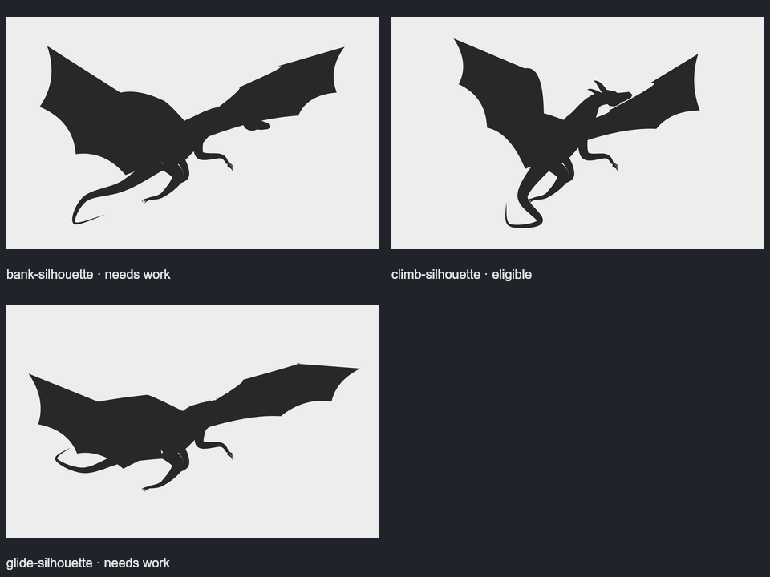
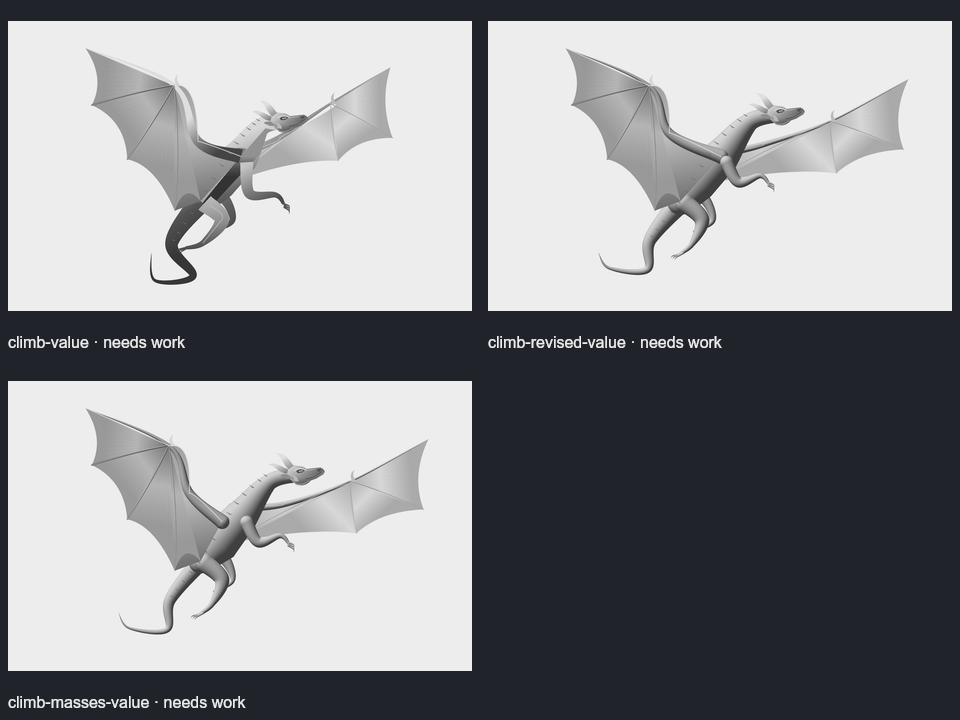
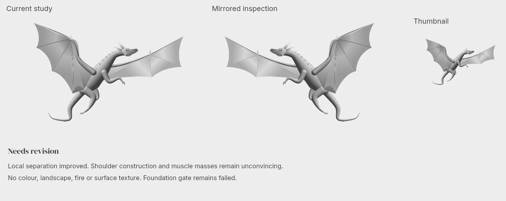
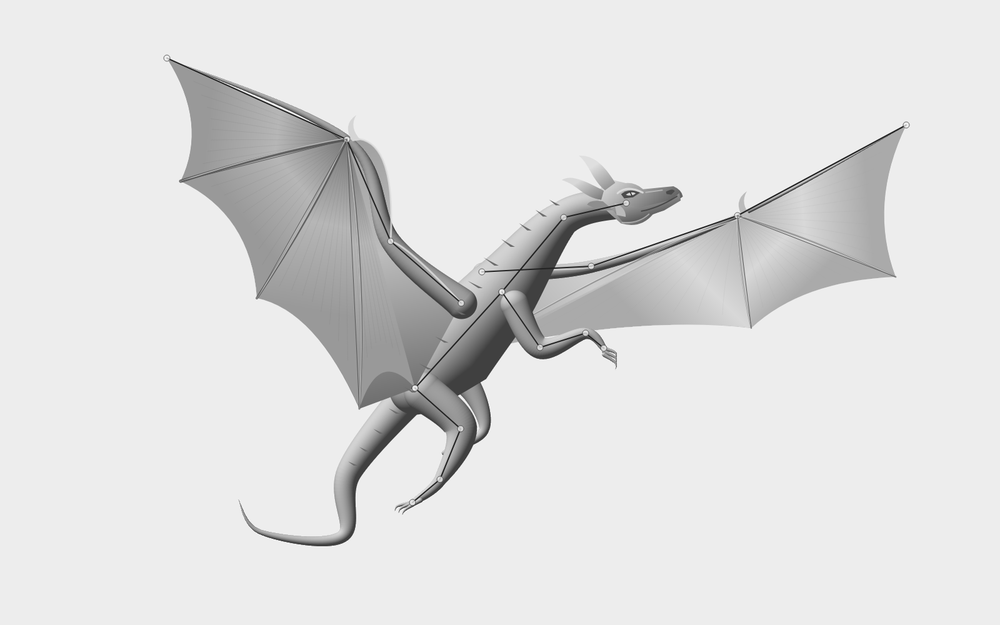

# Dragon foundation study — deliberately unapproved

A follow-up to the rejected oil-style dragon. Scope: **a grayscale flying dragon on a plain background**, using hand-authored 2D construction and value work. No image generation, imported image pixels, 3D scene, landscape, fire or surface texture.


**Status: needs revision.** The drawing is more readable than the original trial, but still has an elementary anatomical design and overly tubular forms. Shoulder junctions and muscle masses do not meet the intended quality. It is not approved for painting or decoration. Both blocking criteria and the human-review requirement remain active.

## The actual process

Three different silhouettes were rendered. The banking and gliding versions lost the head inside the far wing; both received blocking issues and were rejected. The climbing pose retained a clear head/neck contour and was selected for further construction.



The initial value study had a jaw/wing tangency, a foot/tail merger and hard shading strips. Revision one separated those contours and changed the value construction. Revision two separated the wing and foreleg roots, broadened the torso, tapered the tail and reduced shading discontinuities. These are local improvements; they do not establish excellent anatomy or art.



The reviews explicitly fail construction and overall quality. They preserve each parent, correction hypothesis, comparison verdict, strengths, weaknesses and blocking issues. The session remains on its foundation stage. A `select` request for the latest candidate is rejected; high technical confidence cannot approve it.

## Reference study

- [Bat wing photograph and anatomical labels, JT Biohistory Research Hall](https://www.brh.co.jp/research/hisato_kondo/9/img/img_article04.jpg): viewed the arm chain, wrist-centred finger fan, unequal membrane scallops and differing wing projections. These informed the construction landmarks.
- [Smithsonian bat anatomy explanation](https://www.si.edu/spotlight/bats/batfacts): the wing is supported by elongated arm and finger bones; a separate clawed thumb helps distinguish the wrist from the wing tip. The dragon's six limbs are invented anatomy, not a claim about real bats.
- [Todd Lockwood, _Musculature of the Greater Dragon_](https://www.toddlockwood.com/musculature-of-the-greater-dragon/): viewed as a quality and construction reference. The substantial ribcage, muscle groups and separate wing/forelimb supports exposed the weakness of uniform tubes in this study. The work was not traced or sampled.

The first two studies were recorded before drawing. The third was appended through the `study` action during revision. Reference observations and applications are preserved in the session. No reference image was downloaded into or used as an input to the artwork.

## Reusable system changes exercised

`art.guides` resolves named points, anchored offsets and M/L/Q/C/Z curves. Structural landmarks can move while dependent handles and paths remain connected. It provides editing mechanics; it does not know anatomy.

Production stages now support minimum initial alternatives, required reference studies and a declared human reviewer. Reviews support blocking issues and preserved history. Revision captures name a parent and hypothesis; a review must compare the actual revision to its parent. `status` and `compare` report eligibility reasons. Read the general process in `docs/agent-art-workflow.md` or CLI/MCP `studioHelp`.

The numeric ratings in this study are the creating agent's subjective assessments. No human approval of the new image has been supplied. The software does not authenticate reviewers or automatically determine artistic truth.

## Inspect and reproduce

```sh
npm run build
node dist/cli.js render examples/dragon-foundation -o /tmp/dragon-study.png
node examples/dragon-foundation/inspect-and-replay.mjs
```

The inspection script creates full, mirrored and thumbnail views, a construction overlay, a portable scene, and an audit. It rebuilds the drawing in an empty temporary project using only the inline JavaScript and parameters from the selected working graph. No PNG inputs, caches or history are copied. Cold rendering, portable rendering and the code-only rebuild match byte for byte. See `output/audit.json`.





The root scene preserves the current **work in progress** so it renders without the ignored development journal. Exporting a work in progress does not approve it or advance the production stage. `run.mjs` retains the trial-driving operations. Use a new candidate ID for further revisions and a real human review if the foundation eventually merits approval.
