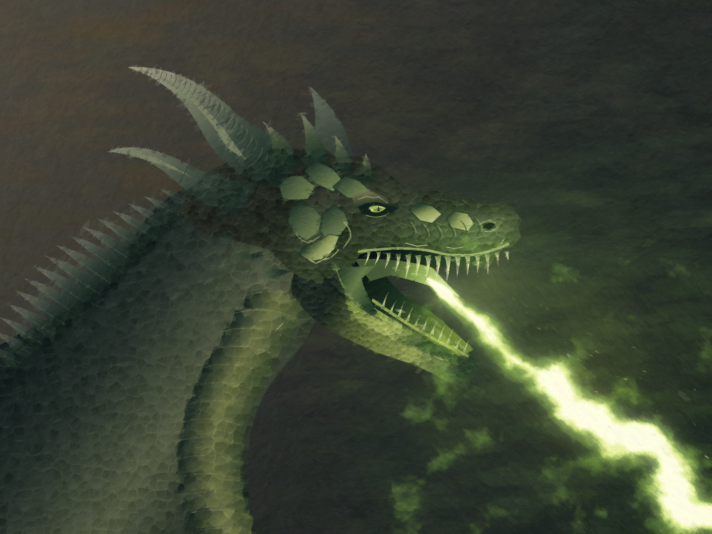

# Dragon head illuminated by green fire

A focused test requested after the full dragon studies fell far below the user's supplied quality reference. The final study is **below the artistic target**. It demonstrates original code-driven 2D drawing and local revisions, not reliable production of excellent painting.



The reference was the user-supplied dragon oil-style image, visually inspected in the conversation. No reference pixels, external image assets, image-generation tools, meshes, camera or 3D renderer were used. The study uses existing Rtistree primitives; it introduces no new engine API.

## Method and revisions

`programs/portrait.js` authors the neck, skull, cheek, jaw, horns, eye, gums and teeth as 2D paths. Separate light fields and clipped gradients describe invented facial masses. Seeded marks supply surface variation. The flame uses a tapered 2D noise field and compositing. Directional paint marks sample only this program's own underpainting.

- `output/values-0.png`: initial grayscale construction. Readable, but conspicuously geometric.
- `output/paint-0.png`: first colour experiment. Oversized eye, uniform scale tiles and cable-like fire.
- `output/paint-1.png`: smaller eye, changed snout contour, shaded facial masses, connected throat web and turbulent flame. The head remained too smooth and the scale rows too regular.
- `output/paint-2.png` / `output/study.png`: irregular cells that inherit the underlying form's colours, more explicit cheek and brow plates, muzzle wrinkles and horn ridges. These are local improvements; the attachments, anatomy and painterly quality remain unconvincing.
- `output/revisions.png`, `mirrored.png`, `grayscale.png` and `thumbnail.png`: inspection artifacts.

This was one composition developed into a focused illumination experiment. It did **not** carry out the full three-composition, independently reviewed foundation workflow. The production session records an assessment after the experiment, with failed criteria and an unmet human review requirement; it does not retrospectively certify the earlier stages. No human approval has been inferred.

## Reproduction

From the repository root after `npm run build`:

```sh
node examples/dragon-head-study/render.mjs paint 2
node examples/dragon-head-study/verify.mjs
```

The verification script compares a cold render, a portable export and a fresh project rebuilt from frozen code and parameters alone. It also checks that the failed study cannot be selected as an approved candidate. `output/audit.json` records the actual results. The authoring scene is frozen as work in progress, so the example remains usable without its ignored development journal.

The practical finding is that existing primitives can express the drawing and local corrections. They do not supply the artistic decisions required to approach the reference. Irregular texture is better than a uniform scale grid, and a turbulent flame is better than a glowing line, but neither solves weak anatomy or makes the brushwork masterful.
