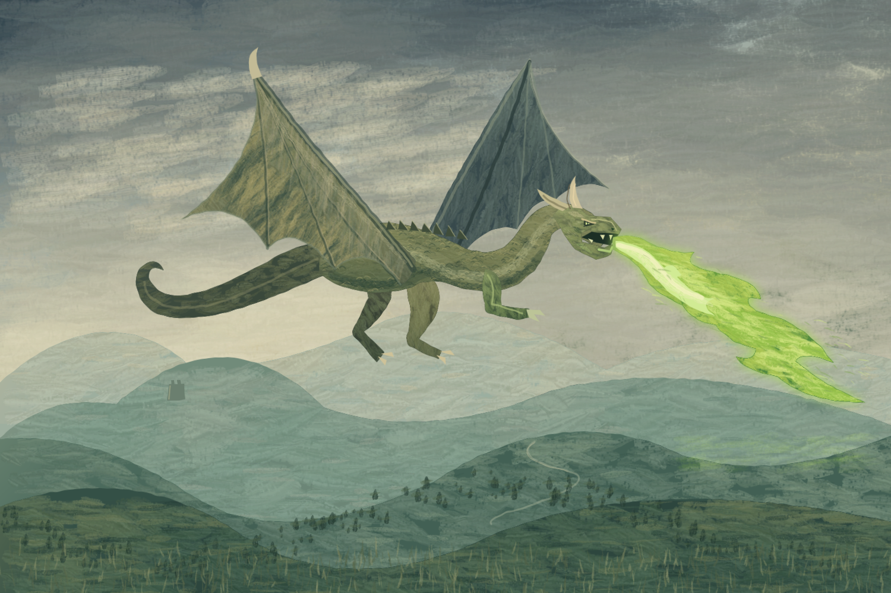
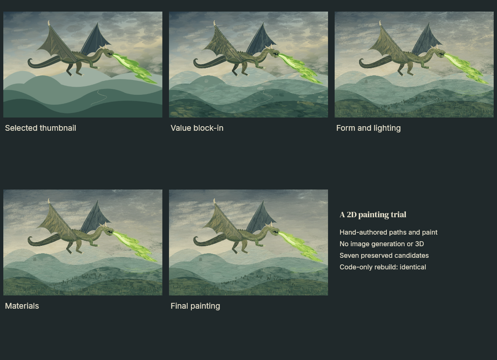

# Dragon in flight — a 2D oil-style painting trial

**Retrospective: the user rejected this result for poor artistic quality. The earlier passing visual scores were false positives.** The technical reproduction checks remain valid. See the foundation-first follow-up in `../dragon-foundation/`.

Brief: **Create a dragon mid flight breathing green fire across a hilly landscape, oil painting style.**

This trial uses hand-authored Canvas paths, procedural colour, seeded bristle strokes, scumbling, glazing and a small coordinate warp. No image-generation tools, photographs, stock textures, downloaded assets or 3D renderer were used. The only image inputs are this project's own earlier painting passes.



The brief is clearly represented. The outcome is a stylized fantasy illustration with oil-like brushwork; stiff wing anatomy, geometric teeth/claws and smooth large hill contours keep it below the standard of an accomplished traditional oil painting. Passing the stage-specific workflow gates does not certify universal artistic excellence. Ratings were supplied by the creating agent after viewing the rendered images; they are subjective, not independent evaluation.

## What the trial exercises

- Three composition thumbnails, visually compared before choosing the larger, balanced silhouette.
- Five stages: thumbnails, value block-in, form/lighting, materials and finishing. Seven candidates were captured in total.
- Hash-bound visual reviews with specific strengths, weaknesses and evidence for every stage criterion. Full-size head and wing crops were inspected at finishing.
- Four connected programs: landscape, dragon, fire and a finishing composite. The shared composition parameter affects the dragon and fire; the landscape stays cached. The finishing node rebuilds from changed inputs.
- Immutable candidate scenes and PNGs, undoable selection, and a complete local production session in `studio/`.
- A portable scene and inline editable pipeline. The final scene is also written to the root `scene.json`, so the example renders without the ignored development history.



## Reproduce and edit

From the repository root:

```sh
npm run build
node dist/cli.js render examples/dragon-oil-trial -o /tmp/dragon.png
node examples/dragon-oil-trial/replay.mjs
```

`replay.mjs` copies **only inline JavaScript and JSON parameters** from the portable scene into a new empty temporary project. It does not copy any PNGs, frozen recipe input images, caches or history. It builds all four nodes and compares the result byte for byte with `output/final.png`. It then checks an unchanged build, changes the composition parameter, verifies which nodes rebuild, and undoes the edit.

To make your own variation, edit `pipeline.json` and `programs/painting.js`, then explicitly run `node dist/cli.js pipeline examples/dragon-oil-trial examples/dragon-oil-trial/pipeline.json`. This changes the working scene and supports normal undo. Create a new production session ID to review a new series; the `dragon` session is complete. `trial.mjs` records the stage-driving commands used for this trial and rejects builds into a completed stage. Use `replay.mjs` for a fresh reconstruction.

Program source contains four painting passes with shared helpers. The engine accepts separate source files per node; use them when independent code edits should leave other nodes cached. Each selected candidate preserves the exact source bytes it ran, even if the working file is subsequently formatted or edited.

## Evidence

| Check                                   | Result                                                                        |
| --------------------------------------- | ----------------------------------------------------------------------------- |
| Cold full render                        | Identical PNG                                                                 |
| Portable scene render                   | Identical PNG                                                                 |
| Four individual recipe replays          | Identical outputs                                                             |
| Fresh project, code and parameters only | Identical PNG                                                                 |
| Unchanged pipeline                      | All four nodes cached                                                         |
| Composition edit                        | Landscape cached; dragon, fire and finish rebuilt                             |
| Undo composition edit                   | Identical original PNG                                                        |
| Aesthetic assessment                    | Useful stylized result; further work needed for excellent traditional oil art |

See `output/audit.json`, `output/code-only-replay.json`, `review-*.json`, `output/thumbnails.png`, and the candidate evidence under `studio/`. Technical scene verification had zero authored scene rules, which is explicitly recorded; the separate reproduction checks supply the technical evidence above.
