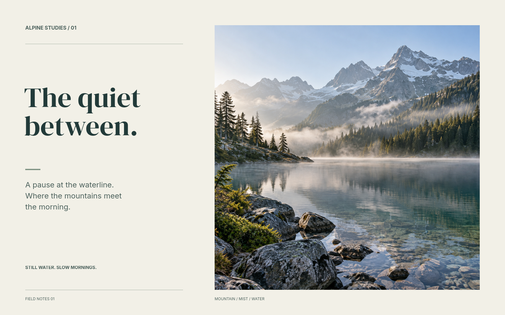

# Generated photograph fitted into an editable scene

One square alpine photograph was created with Codex's built-in `image_gen` tool, then inspected and placed into a 1600 by 1000 Rtistree canvas. The exact prompt is in [prompt.txt](prompt.txt), and source dimensions/hash and generation method are in [generation.json](generation.json). The landscape is generated, not a documented location.



After inspecting [the initial placement](output/before.png), the agent used typed Rtistree commands to add the title, supporting text, rules and captions. All text and graphics remain independent editable layers. The generated source was copied byte-for-byte into the project and was neither regenerated nor retouched.

[The result](result.json) records passing verification, uncached equality, portable-export equality, and **zero changed pixels within the 840 by 840 placed photograph**. This is a same-agent visual review and a fitting/composition trial. It does not test seamless photographic extension, independent aesthetic evaluation or CMYK/print export.

## Reproduce

From the repository root, after `npm run build`:

```sh
node dist/cli.js render examples/generated-asset-trial/final.scene.json -o /tmp/alpine-composition.png
node examples/generated-asset-trial/replay.mjs
```

`final.scene.json` is the final resolved scene, independent of the ignored working history. `scene.yaml` plus `layers/photograph.yaml` describe the initial placement. `compose.patch.json` contains the edits selected in this conversation after viewing that placement. `audit.json` retains the transaction, and `benchmarks/generated-alpine/` retains critiques/checkpoints and a portable export.

The replay command copies the initial project into a fresh temporary directory, applies the recorded patch, checks the photograph's pixel preservation and compares with the saved final PNG. It replays the actual edits; it is not a new unscripted agent run. PNG byte identity is supported on the same renderer/runtime/platform as the saved evidence.

The source is 1254 pixels square: at 300 ppi it supplies approximately 106.2 mm square of native image detail. Larger physical placements need lower effective ppi or resampling, which is why the current print preflight checks effective source resolution.
