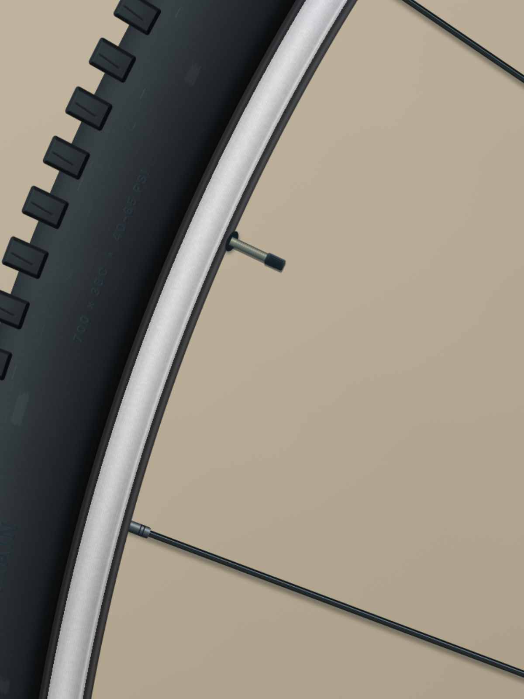
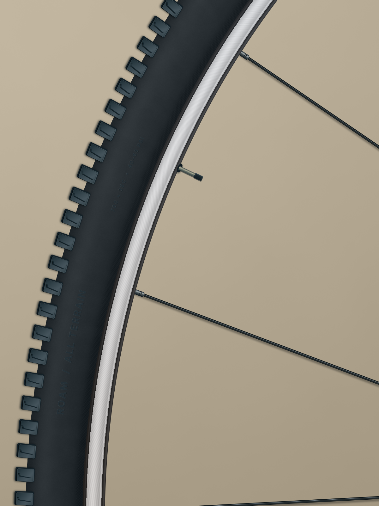
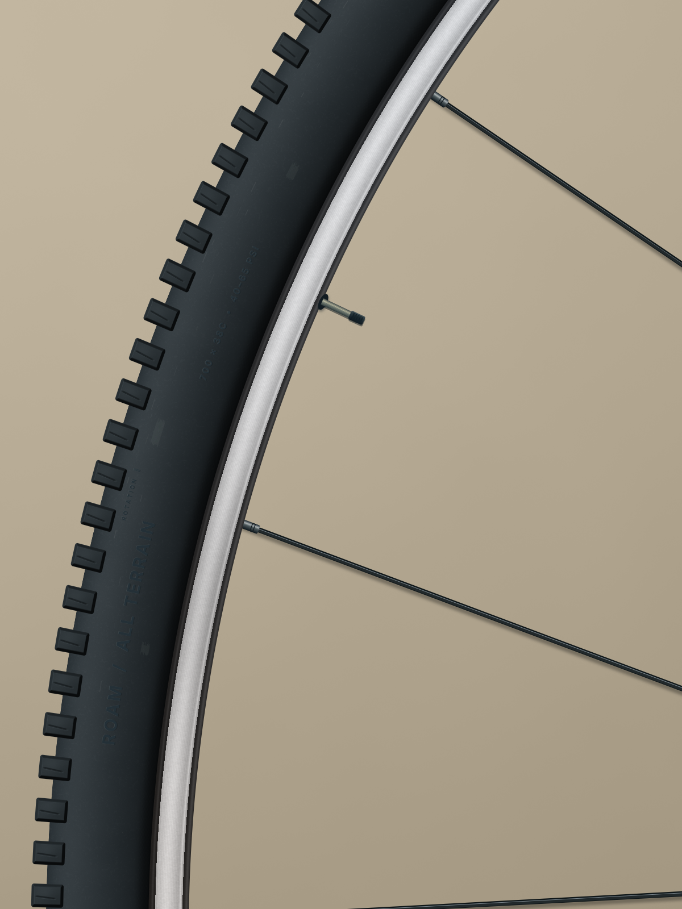

# A wheel painted without image generation

Brief: **create a close-up shot of a bicycle wheel, its tyre and machined rim in soft window light**, using traditional digital-art techniques. No image-generation model, downloaded photograph or pixels from the user's reference were used. Every image asset was calculated from JavaScript, geometry, material fields, text or brush strokes. All eight final recipes have zero image inputs.



The artwork contains separate background, spoke, tyre, tread, rim, lettering, wear and valve layers. A further scene variant applies a group transform for a closer crop. The painting programs remain editable; each baked asset records the exact source text, seed and parameters that produced it. Changing a program requires an explicit rebake.

## What happened

1. The first pass established curved geometry, the machined rim, repeated tread, spokes, valve and sidewall lettering. It read as a clean technical illustration.
2. Visual inspection prompted bevels and surface variation. The intermediate `refined.png` overdid texture and produced a camouflage-like surface; that result is retained rather than presented as an improvement.
3. The final pass uses height-field normals and directional lighting for the rubber and tread, quieter texture, sparse pressure-varied abrasions and less regular rim highlights. A near-zero pressure dab exposed a native gradient failure, which was fixed in the studio.





**Technical result:** the final asset recipes rebuild from code without image inputs. Cold composition and portable export reproduce the saved PNG. The full history snapshot is retained in `audit.json`.

**Artistic result: partial.** This is a coherent wheel illustration, but it still looks synthetic. Repeated tread shapes, simplified environment lighting and some deliberate-looking scuffs prevent it from convincingly reading as a photograph. The same agent authored and reviewed it; this is not an independent artistic evaluation. The benchmark's `status: fail` intentionally reflects those remaining medium-severity visual findings despite mechanical replay passing. The eight-edit refinement budget was respected. The closer framing is a separate composition variant of the same painting, not a new independent trial.

## Reproduce

From the repository root:

```sh
npm run build
node examples/manual-wheel-trial/replay.mjs
node dist/cli.js render examples/manual-wheel-trial/final.scene.json -o /tmp/wheel.png
node dist/cli.js render examples/manual-wheel-trial/macro.scene.json -o /tmp/wheel-macro.png
```

The replay creates a temporary project containing **newly rendered outputs**, not copies of existing image assets. It copies recipe source/metadata, checks that every recipe has zero image inputs, executes all eight recipes, reconstructs the scene and compares both final compositions byte-for-byte. It writes `output/replay.json`. This proves reproduction, not a new autonomous painting attempt.

`programs/wheel-initial.js` preserves the first authoring version. `programs/wheel.js` is the final working source, and content-addressed `recipes/` retain the exact intermediate versions used by individual passes. `before.scene.json`, `final.scene.json`, `macro.scene.json`, `brief.json`, `result.json` and the benchmark directory contain the authored state and review evidence. `scene.json` is the empty starting scene; use the final scene files when rendering a fresh clone without local history.
