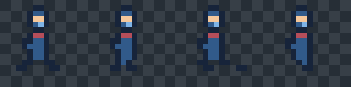

# Pixel sprite lab



This is a complete, deliberately small pixel-art deliverable: a transparent four-frame
lantern-sentinel walk cycle, packed into a power-of-two atlas. The source is editable
palette-tile data, not a flattened PNG. `pixel_art.strict` makes the declared six-colour
palette and integer, unsmoothed one-scene-pixel tile geometry part of scene validation.

Each 16 × 16 frame has the same foot pivot (`[8, 14]`) and a 120 ms duration. The animation
loops in `walk_right`; its frame order, pivots, tags, durations, atlas padding, and one-pixel
edge extrusion all travel in the generated manifest.

From the repository root, build the package and regenerate the atlas plus a nearest-neighbour
contact sheet:

```sh
npm run build
node examples/pixel-sprite-lab/render-review.mjs
node examples/pixel-sprite-lab/verify.mjs
```

The first command writes `output/sentinel-atlas.png` and `output/sentinel-atlas.json` with the
first-class `rtistree sprites` exporter. It then builds `output/walk-review.png`, a 8× checkerboard
review sheet intended for visually checking silhouette, transparency, frame cadence and the loop
seam. The verifier checks atlas/manifest agreement, exact source-to-atlas pixels, transparent
frame margins, fixed pivots, declared-palette-only output, and deterministic cold export.

Use this as the minimal pattern for a game asset: put one or more palette tiles in a strict
pixel-art scene, declare sprite bounds plus pivots/durations/tags, then export an atlas rather
than hand-assembling it in application code.
