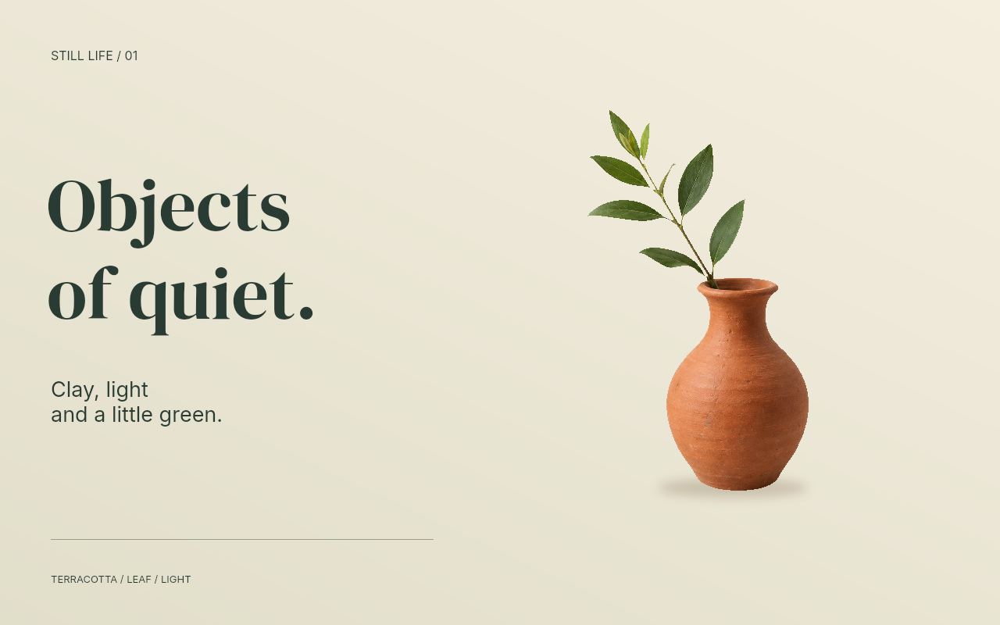

# Masked generated asset, two layouts, and CMYK print

One Codex built-in `image_gen` call created a terracotta vase with a leafy sprig on a neutral background. [The exact prompt](prompt.txt) and [generation record](generation.json) are retained alongside the original PNG. Rtistree then extracted the background with a colour-range mask, inverted/shrank/feathered the selection, applied a small white-balance adjustment and added an independent contact shadow.



The agent inspected the initial placement, the extraction and the rendered PDF. Inspection exposed a light fringe and rectangular boundary, leading to a fix in mask processing order. Text, shadow, background, mask and adjustment remain editable. The portrait version repositions the same subject and uses the mask's captured reference size to keep the extraction attached during resizing.

## Artifacts

- `scene.json` and `refine.patch.json`: initial source and the chosen edits.
- `final.scene.json`, `portrait.scene.json`: final standalone scene descriptions.
- `audit.json`, `result.json`, `benchmarks/masked-vase/`: history, same-agent critiques, locality and reproduction evidence.
- `output/landscape.pdf`: 160 by 100 mm trim, 3 mm bleed, crop marks, ICC-managed CMYK.
- `output/portrait.pdf`: 100 by 160 mm trim, the same bleed/profile policy.
- `output/landscape.tif`, `output/landscape.jpg`: CMYK raster exports at 300 ppi.
- `output/pdf-preview.png`, `output/portrait-pdf-preview.png`: proof images rendered from the final PDFs.

PDF outputs retain embedded text fonts and vector rules/gradients; the extracted subject and shadow use raster layers. Export sidecars read back the actual dimensions, colour spaces, profiles and font descriptors. The sampling resolution of the source exceeds 300 ppi at these placements. This is a controlled neutral-background extraction, not general-purpose segmentation or an independently scored visual benchmark.

## Reproduce

After `npm run build`, from the repository root:

```sh
node examples/print-trial/replay.mjs
graphics render examples/print-trial/final.scene.json -o /tmp/vase.png
graphics export examples/print-trial/benchmarks/masked-vase/export --preset print -o /tmp/vase-print.pdf
```

The replay script starts with a fresh copied project, applies the recorded patch and checks the final PNG against the saved composition on the same runtime/platform. It also performs a fresh CMYK PDF export/read-back. It does not make a new generation request or constitute a new unscripted agent trial.

## Demo profile provenance

`profiles/demo-cmyk.icc` was extracted from the built-in `cmyk` profile in the pinned Sharp/libvips build. Its description is **Chemical proof**. Its copyright tag reads: “Created by Graeme W. Gill. Released into the public domain. No Warranty, Use at your own risk.” It is included to reproduce this example; it was not selected for a particular printer, paper or press. Use the actual printer's profile for production.
