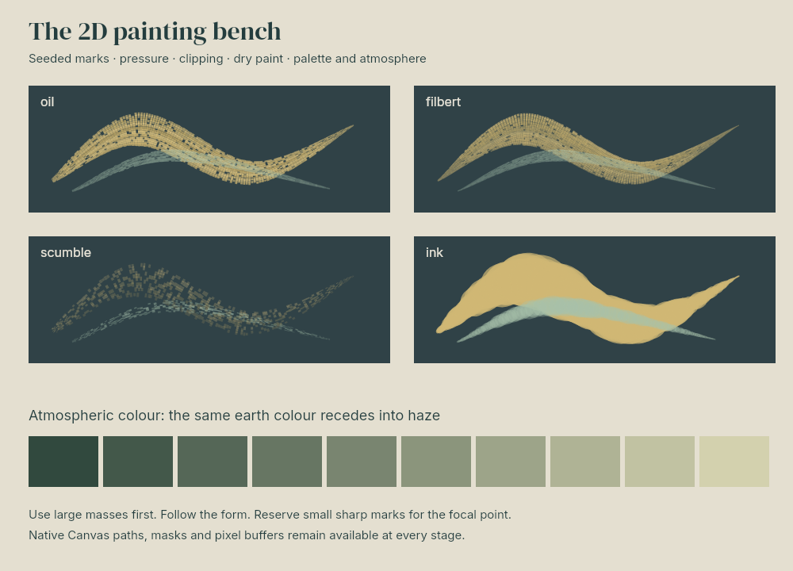

# Reusable 2D painting techniques

`programs/study.js` demonstrates oil, filbert, scumble and ink settings, optional curve smoothing, pressure, dry paint and atmospheric palette interpolation. These are reusable primitives rather than subject templates. `scene.json` and `portable/scene.json` contain the baked study and its replayable recipe.

Render with `node dist/cli.js render examples/technique-study/scene.json -o /tmp/techniques.png`. For the complete API and staged workflow see `docs/atelier.md` and `graphics studio-help`.
