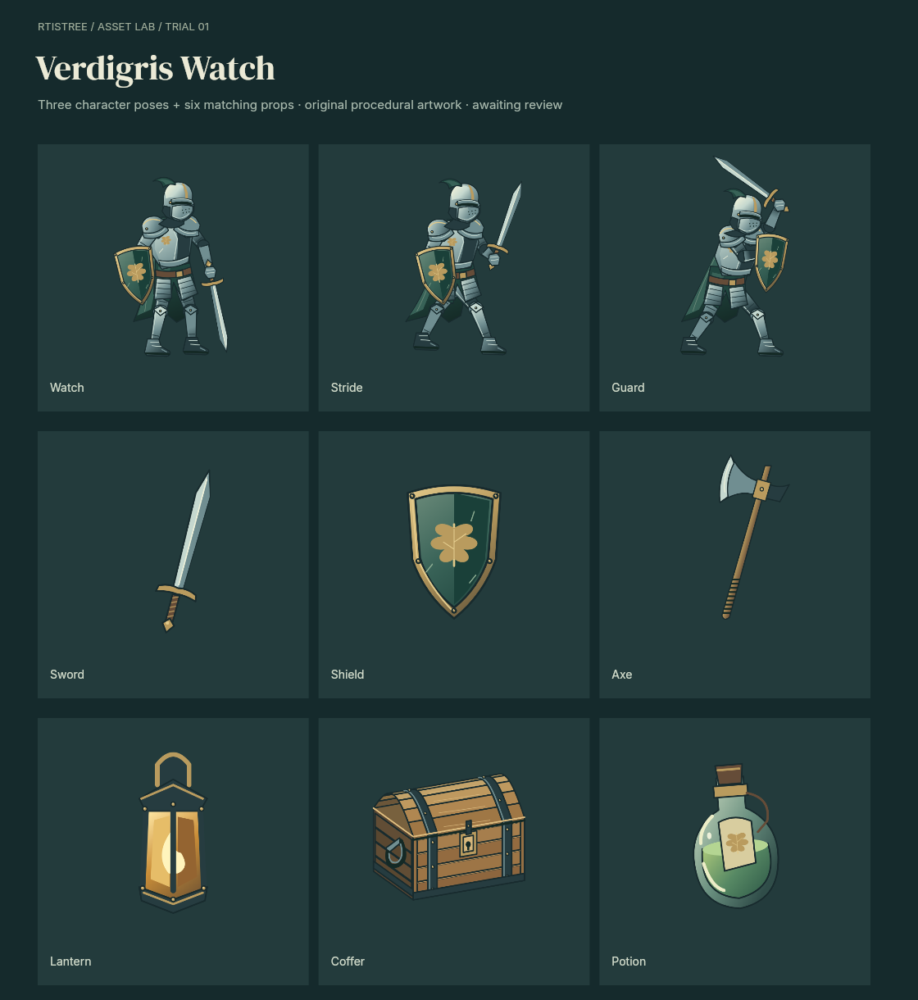

# Verdigris Watch — revised procedural asset trial

**The original failed user review. The current revision has no visual approval.**



Rtistree's existing 2D studio draws 17 transparent sprites: three sentinel poses,
six props and eight walk frames. No image generation, imported pixels, 3D renderer
or engine modifications. Sword and shield drawing functions are shared between
the character and inventory icons.

Open `viewer.html`, or run from the repository root:

```sh
node examples/warden-asset-trial/serve.mjs
# http://127.0.0.1:4178
```

The Version selector compares revision 4, previous revision 3 and the rejected original. Ground
motion exposes the walking direction. The viewer also supports frame stepping,
playback speed, backgrounds, mirroring, pivots and PNG downloads.

Rebuild and check this revision:

```sh
npm run build
node examples/warden-asset-trial/render.mjs foundation 4
node examples/warden-asset-trial/render.mjs finish 4
node examples/warden-asset-trial/verify.mjs
```

Drawing source is `programs/assets.js`. `programs/motion.mjs` contains the pure
walking construction used both by the renderer and direction/ground-contact
checks. `render.mjs` embeds that exact function into each frozen studio recipe.
`manifest.json` records parameters, hashes and recipe locations. Earlier recipes
retain their own source snapshots; the editable program is the current revision.

The atlas is 2560 × 2560 with 512 × 640 untrimmed frames. Frame rectangles and
pixel pivots are in `output/atlas.json`: `[256, 570]` for characters and
`[256, 320]` for props. Walk uses one facing and eight frames at 8 fps. One cycle
corresponds to 86 2/3 logical pixels of forward travel (173 1/3 native pixels).
The viewer's ground markers use that speed. Atlas assembly copies RGBA pixels
exactly. `portable/scene.json` contains a self-contained contact-sheet export.

`rejected-v1/` preserves the original images, code, recipes and review. The old
walk, coffer and poses remain explicitly marked as rejected. The asset pack
includes both image sets so the viewer's comparison also works after extraction.

See [review.md](review.md) for the missed defects, corrections and limitations.
[output/audit.json](output/audit.json) separates replay/export and motion checks
from `visual_pass: false`. Passing those checks does not approve the artwork.

Revision 4 responds to the next user review: forward walking was confirmed, while
excess knee bend, the angular helmet and the crossed guard arms needed correction.
`previous-v3/` preserves that intermediate source, imagery and feedback.
