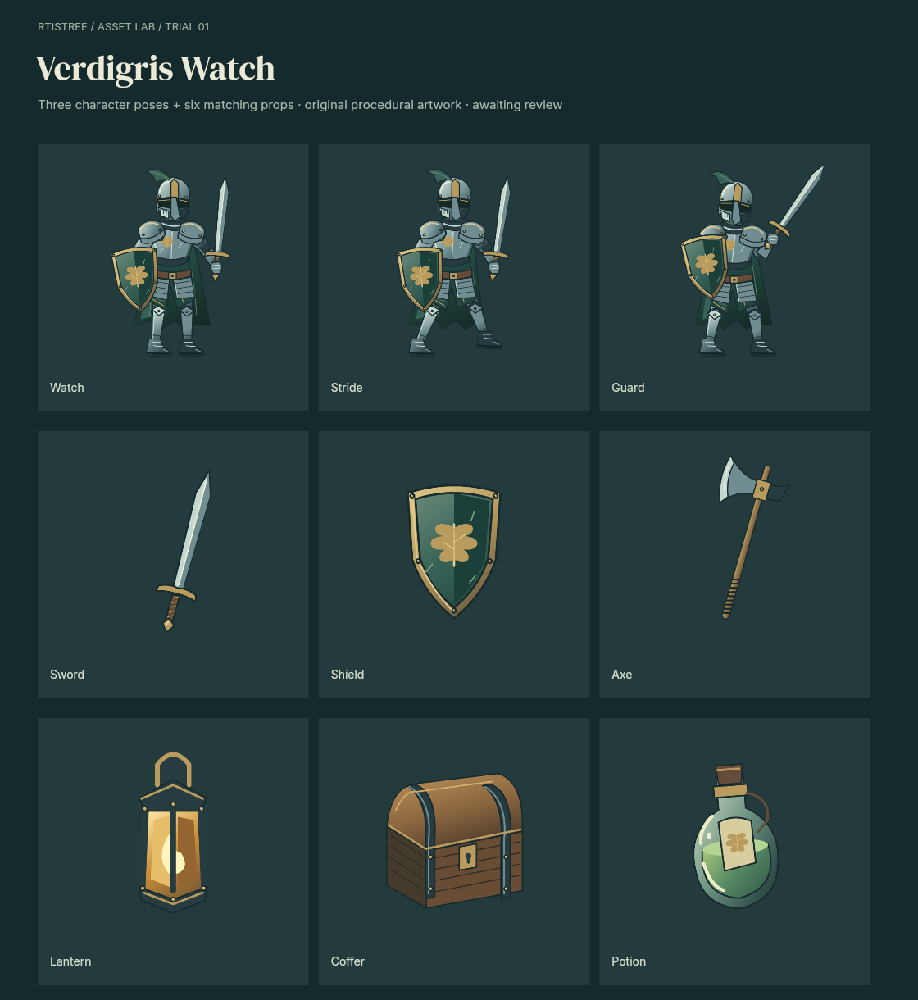

# Verdigris Watch — procedural asset trial

An original fantasy asset family built with Rtistree's existing raster studio.
**Trial awaiting user review.** No image generation, imported image pixels, 3D,
external service or engine changes.



The deliverables are three sentinel poses, six props, eight walk frames, a
transparent atlas, frame/pivot metadata, an inspection viewer, and saved recipes.
The sword and shield use the same drawing functions in the character and icons.
The rig uses named shoulder, elbow, wrist, hip, knee and ankle landmarks.

Open `viewer.html` directly, or run from the repository root:

```sh
node examples/warden-asset-trial/serve.mjs
# Open http://127.0.0.1:4178
```

The viewer supports asset selection, three canvas sizes, dark/light/checkerboard
backgrounds, mirror, pivots, frame stepping, playback speed and PNG downloads.
It inspects baked pixels; drawing changes happen in `programs/assets.js`.

Rebuild the final assets and verify them:

```sh
npm run build
node examples/warden-asset-trial/render.mjs finish 2
node examples/warden-asset-trial/verify.mjs
```

`manifest.json` names all 17 assets and records parameters, seed, hashes and recipe
locations. `output/atlas.json` uses top-left pixel coordinates, untrimmed 512 × 640
frames and pixel pivots. Character pivots are `[256, 570]`; prop pivots are
`[256, 320]`. Walk playback is eight frames at 8 fps. All frames share one facing.
The atlas is 2560 × 2560; unused cells are transparent. It uses exact RGBA copies
to avoid compositing changes at antialiased edges. Render the contact sheet with
Rtistree's standard CLI using `contact-sheet.scene.json`. `portable/scene.json`
is a self-contained export with all registered assets and recipes.

The frozen foundation sheets and initial walk sheet preserve the trial's earlier
results. Their recipe snapshots retain the source used at the time; the editable
program contains the latest revision. `render.mjs foundation 1` can make a new
foundation sheet from the current source.

See [the brief](brief.md), [visual review](review.md) and
[technical audit](output/audit.json). The audit checks every recipe replay,
output hash, nonempty alpha, transparent border and atlas frame; it also compares
cold and portable scene renders. These checks are separate from artistic quality.

The character remains a simplified illustration, with a rigid upper body and a
basic walk loop. This does not establish parity with the reference, complete
directional animation, or production readiness.
